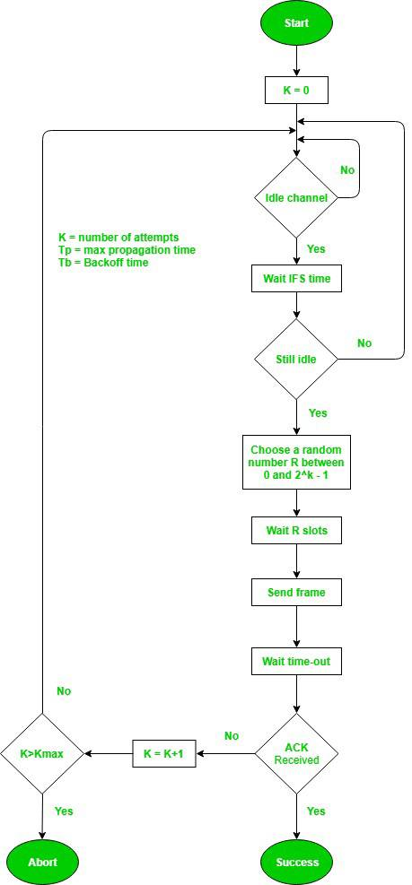
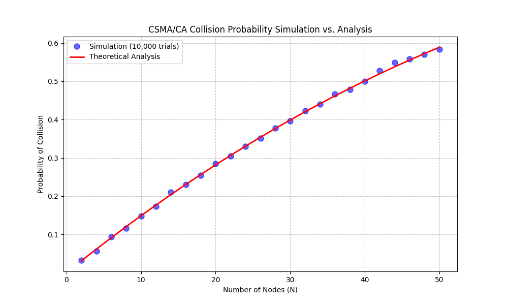

# 期中作業

[csmaca碰撞機率模擬與分析](https://github.com/Dong-HuiYun/_cm/tree/main/%E6%9C%9F%E4%B8%AD%E4%BD%9C%E6%A5%AD)

### 功能介紹

主要用途：模擬無線網路中（如Wi-Fi）CSMA/CA機制的碰撞機率，並與理論公式進行比較。

- CSMA/CA：載波偵聽多重存取/碰撞避免，是Wi-Fi使用的通道存取協議

- Backoff機制：當節點要傳送資料時，會隨機選擇一個退避時間（0到CW之間）

- 碰撞發生：當多個節點選到相同的退避時間最小值時

- 模擬函數`simulate_collision_probability`

    - 每個節點隨機選擇一個退避值（0到CW）

    - 找出最小值

    - 檢查有多少節點選擇了這個最小值

    - 如果超過一個節點，則發生碰撞

- 主要分析：

    - 節點數從2到50（每隔2個節點）

    - 固定競爭窗口 CW = 31（即32個時槽）

    - 每個設定進行10,000次模擬

### 圖表分析

**在 CSMA/CA 協議下，碰撞機率隨節點數量增加而上升的趨勢。最關鍵的發現是，通過 10,000 次試驗獲得的模擬數據（藍色圓點）與理論分析（紅色實線）高度吻合，這驗證了理論模型在預測網路效能方面的準確性。**

### 運用到的數學

#### 1. 離散均勻分配 (Discrete Uniform Distribution)
在模擬中，每個節點會從 $[0, CW]$ 的區間內隨機選擇一個整數作為倒數值。
*   **數學表達：** 設隨機變數 $X$ 為節點選擇的數值，則 $X \sim U(0, CW)$。
*   每個數值被選中的機率皆為 $P(X = k) = \frac{1}{CW+1} = \frac{1}{W}$（其中 $W$ 為窗口大小）。

#### 2. 獨立事件 (Independent Events)
程式假設 $N$ 個節點的行為是相互獨立的。這意味著一個節點選什麼數字，不會影響另一個節點。
*   在計算理論機率時，我們使用乘法原理：$P(A \cap B) = P(A) \cdot P(B)$。

#### 3. 互補事件機率 (Complementary Probability)
程式計算「碰撞機率」的方式是先計算「成功傳輸（不碰撞）的機率」，再用 1 減去它。
*   **公式：** $P(\text{Collision}) = 1 - P(\text{Success})$
*   **定義：** 「成功傳輸」是指在所有節點中，**恰好只有一個節點**選到了最小的倒數值。

#### 4. 組合數學與機率模型 (Combinatorics & Probability Model)
在 `theoretical_collision_probability` 函數中，使用了以下公式：
$$P(\text{Success}) = \sum_{k=0}^{CW} \left( N \cdot \frac{1}{W} \cdot \left( \frac{W-1-k}{W} \right)^{N-1} \right)$$
這個公式的組成包含了：
*   **恰好一者選中 $k$：** $C(N, 1) = N$。
*   **該節點選中 $k$ 的機率：** $\frac{1}{W}$。
*   **剩餘 $N-1$ 個節點都選中比 $k$ 大的數值的機率：** $\left( \frac{W-1-k}{W} \right)^{N-1}$。
*   **全機率定理 (Law of Total Probability)：** 因為最小值 $k$ 可能是 $0, 1, \dots, CW$ 中的任何一個，所以對所有 $k$ 進行累加。

#### 5. 蒙地卡羅模擬 (Monte Carlo Simulation)
`simulate_collision_probability` 函數運用了蒙地卡羅方法。
*   當理論模型太過複雜或難以推導時，我們通過大量重複隨機試驗（`trials=10000`），利用**大數法則 (Law of Large Numbers)** 來逼近真實的機率分佈。
*   模擬結果（藍點）會隨著試驗次數增加而收斂於理論曲線（紅線）。

#### 6. 統計分析與數據可視化
*   **變數依賴關係：** 探討節點數 $N$（自變數）與碰撞機率 $P$（應變數）之間的關係。
*   **趨勢分析：** 程式展示了隨著 $N$ 增加，碰撞機率呈非線性增長的特性（飽和曲線）。

### 參考資料

[google ai studio](https://aistudio.google.com/app/prompts?state=%7B%22ids%22:%5B%221OlOuVfRKeh85m68PjIrpe0cTiYxlxm8X%22%5D,%22action%22:%22open%22,%22userId%22:%22104108532823114063447%22,%22resourceKeys%22:%7B%7D%7D&usp=sharing)

[manus圖表分析](https://manus.im/share/hUvUgakK3naYHT2SAzsPIH)